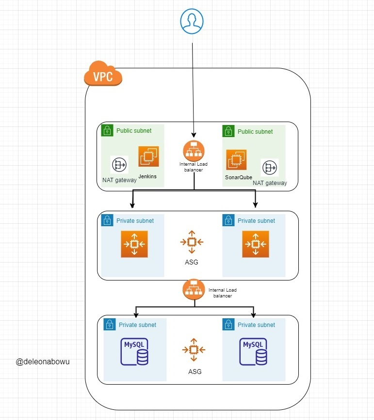

In this project , we shall be creating infrastructure and kubernetes EKS cluster in AWS using Terraform reusable modules.




Code re-use is essential as the same code can be leveraged and used accross teams, projects, environments and teams. It also promotes consistency and standardisation and can be used to enforce best practices in your organisation. Other advantages are easier collaboration between teams.

We shall be creating 
1. A VPC
2 public subnets and 2 private subnets 
(I have used 2 private subnets instead of 4 to reduce costs. The lower tier should host the applications MySQL database)
The public subnet will host our Jenkin and SonaQube servers with our Java application in the private subnet.
|We shall also be using only 2 AZ's which is the minimum requirement for an EKS cluster.

3. An Internet Gateway for the Public subnet
4.  Two(2) NAT Gateways in the public subnets for each AZ.
5. We shall deloying an EKS cluster into the private subnets 
6. Cluster Role
7. Nodegroup Role

For this demo, we shall be storing our state flies locally but ideally, it should be stored remotely in an S3 bucket with Dynamo DB for state locking.

Our folder structure will be as follows:
Folder Structure
```
config 
    terraform.tfvars
modules
    aws_vpc
    aws_subnets
    aws_IGW
    aws_nat_gateway
    aws_eip
    aws_route_table
    aws_route_table_association
    aws_eks
    aws_eks_nodegroups

main.tf
providers.tf
versions.tf
variables.tf
README.md
.gitignore
```
Each module folder will contain 3 sub folders
- main.tf
- variables.tf
- output.tf
### Before we start creating our resources, lets declare our provider and versions ############################################################################
### We need to declare the provider we shall be needing which is AWS

### versions.tf

```
terraform {
  required_providers {
    aws = {
      source  = "hashicorp/aws"
      version = "~> 4.0"
    }
  }
}
```


### Since we are creating for AWS, we need to configure the aws provider.

### providers.tf
```
provider "aws" {
  region = var.region
}


```
### Let's start by creating our  VPC ######### VPC ##########################################################
This will be created in aws_vpc/main.tf

### main.tf
```
resource "aws_vpc" "acme_vpc" {
  cidr_block       = var.vpc_cidr_block
  instance_tenancy = var.instance_tenancy

  tags = var.tags
}
```
### variables.tf

```
variable "vpc_cidr_block" {
  default = "10.0.0.0/16"
}

variable "instance_tenancy" {
  default = "default"
}

variable "tags" {
  
}
```
### output.tf
```
output "vpc_id" {
  value = aws_vpc.acme_vpc.id
}
```

####  Let's create our SUBNETS ########################################################################################
This will be created in aws_subnets/main.tf

### main.tf
```
resource "aws_subnet" "main" {
  vpc_id     = var.vpc_id
  cidr_block = var.cidr_block
  availability_zone = var.availability_zone

  tags = var.tags
}

```

### variables.tf
```
variable "subnet_cidr_block" {
  default = "10.0.0.0/24"
}

variable "availability_zone" {

}
variable "tags" {

}
variable "vpc_id" {

}

```
### output.tf

```
output "subnet_id" {
  value = aws_subnet.acme_subnet.id
}

```


### Let's create our INTERNET GATEWAY resource ####################################################
This will be created in aws_IGW/main.tf

### main.tf

```
resource "aws_internet_gateway" "igw" {
  vpc_id = var.vpc_id

  tags = var.tags
}

```

### variables.tf

```
variable "tags" {

}
variable "vpc_id" {

}
```

### outputs.tf

```
output "IGW_id" {
  value = aws_internet_gateway.igw.id
}

```

## Let's create our NAT GATEWAY ##########################################################

To allow internet access from the private subnets
aws_nat_gateway/main.tf

### main.tf

```
resource "aws_nat_gateway" "ngw" {
  allocation_id = var.allocation_id
  subnet_id     = var.subnet_id

  tags = var.tags


}
```

### variables.tf
```
variable "allocation_id" {

}
variable "subnet_id" {

}
variable "tags" {

}
```
### outputs.tf

```
output "nat_gateway_id" {
  value = aws_nat_gateway.ngw.id
}
```

### Let's create the ELASTIC IP #########################################################
This is needed by the NAT Gateway

aws_eip/main.tf

### main.tf
```
resource "aws_eip" "natgw_eip" {

  tags = var.tags
}
```
### variables.tf
```
variable "tags" {

}

```
### outputs.tf

```
output "eip_id" {
  value = aws_eip.natgw_eip.id
}
```


### It's time to create the ROUTE TABLES ###################################################
aws_route_table/main.tf

### main.tf
```
resource "aws_route_table" "rtb" {
  vpc_id = var.vpc_id

  route {
    cidr_block = var.rtb_cidr_block
    gateway_id = var.gateway_id
  }

```

  tags = var.tags
}
### variables.tf
```
variable "vpc_id" {

}

variable "rtb_cidr_block" {
  default = "0.0.0.0/0"
}

variable "gateway_id" {

}

variable "tags" {

}
```

### outputs.tf
```
output "rtb_id" {
  value = aws_route_table.rtb.id
}
```
### ROUTE TABLE ASSOCIATIONS #######################################################
Associate the route tables with their subnets
aws_route_table_associations/main.tf

### main.tf
```
resource "aws_route_table_association" "a" {
  subnet_id      = var.subnet_id
  route_table_id = var.route_table_id
}
```
### variables.tf
```
variable "subnet_id" {

}

variable "route_table_id" {

}
```

### outputs.tf
```
output "rtb_assoc_id" {
  value = aws_route_table_association.a.id
}
```

### That is all we need for our base architecture ############################################
### The next step is to create our eks cluster and roles #####################################

aws_eks/main.tf

### main.tf
```
resource "aws_eks_cluster" "acme_cluster" {
  name     = var.cluster_name
  role_arn = aws_iam_role.acme_eks_cluster.arn

  vpc_config {
    subnet_ids = var.subnet_ids
  }

  # Ensure that IAM Role permissions are created before and deleted after EKS Cluster handling.
  # Otherwise, EKS will not be able to properly delete EKS managed EC2 infrastructure such as Security Groups.
  depends_on = [
    aws_iam_role_policy_attachment.ACME-AmazonEKSClusterPolicy,
    aws_iam_role_policy_attachment.ACME-AmazonEC2ContainerRegistryReadOnly,

  ]
  tags = var.tags
}


data "aws_iam_policy_document" "assume_role" {
  statement {
    effect = "Allow"

    principals {
      type        = "Service"
      identifiers = ["eks.amazonaws.com"]
    }

    actions = ["sts:AssumeRole"]
  }
}

resource "aws_iam_role" "acme_eks_cluster" {
  name               = "acme-eks-cluster"
  assume_role_policy = data.aws_iam_policy_document.assume_role.json
}

resource "aws_iam_role_policy_attachment" "ACME-AmazonEKSClusterPolicy" {
  policy_arn = "arn:aws:iam::aws:policy/AmazonEKSClusterPolicy"
  role       = aws_iam_role.acme_eks_cluster.name
}


resource "aws_iam_role_policy_attachment" "ACME-AmazonEC2ContainerRegistryReadOnly" {
  policy_arn = "arn:aws:iam::aws:policy/AmazonEC2ContainerRegistryReadOnly"
  role       = aws_iam_role.acme_eks_cluster.name
}

```
### variables.tf
```
variable "cluster_name" {
  
}

variable "tags" {
  
}
variable "subnet_ids" {
  
}
```
### outputs.tf
```
output "eks_cluster_output_name" {
    value = aws_eks_cluster.acme_cluster.name
  
}
```

### Creation of our nodegroups ###################################################################################################################################
aws_eks_nodegroups/main.tf


### main.tf
```
resource "aws_eks_node_group" "worker_nodes" {
  cluster_name    = var.cluster_name
  node_group_name = var.node_group_name
  node_role_arn   = aws_iam_role.nodegroup_role.arn
  subnet_ids      = var.subnet_ids

  scaling_config {
    desired_size = 1
    max_size     = 2
    min_size     = 1
  }

  update_config {
    max_unavailable = 1
  }

instance_types = [ "t3.medium" ]


  # Ensure that IAM Role permissions are created before and deleted after EKS Node Group handling.
  # Otherwise, EKS will not be able to properly delete EC2 Instances and Elastic Network Interfaces.
  depends_on = [
    aws_iam_role_policy_attachment.ACME-AmazonEKSWorkerNodePolicy,
    aws_iam_role_policy_attachment.ACME-AmazonEKS_CNI_Policy,
    aws_iam_role_policy_attachment.ACME-AmazonEC2ContainerRegistryReadOnly,
  ]
  tags = var.tags
}

resource "aws_iam_role" "nodegroup_role" {
  name = var.node_group_name

  assume_role_policy = jsonencode({
    Statement = [{
      Action = "sts:AssumeRole"
      Effect = "Allow"
      Principal = {
        Service = "ec2.amazonaws.com"
      }
    }]
    Version = "2012-10-17"
  })
}

resource "aws_iam_role_policy_attachment" "ACME-AmazonEKSWorkerNodePolicy" {
  policy_arn = "arn:aws:iam::aws:policy/AmazonEKSWorkerNodePolicy"
  role       = aws_iam_role.nodegroup_role.name
}

resource "aws_iam_role_policy_attachment" "ACME-AmazonEKS_CNI_Policy" {
  policy_arn = "arn:aws:iam::aws:policy/AmazonEKS_CNI_Policy"
  role       = aws_iam_role.nodegroup_role.name
}

resource "aws_iam_role_policy_attachment" "ACME-AmazonEC2ContainerRegistryReadOnly" {
  policy_arn = "arn:aws:iam::aws:policy/AmazonEC2ContainerRegistryReadOnly"
  role       = aws_iam_role.nodegroup_role.name
}
```
### variables.tf
```

variable "cluster_name" {
  type = string
}
variable "subnet_ids" {
  
}

variable "node_group_name" {
  
}
variable "tags" {
  
}

variable "node_i_am_role" {
  
}
```
### outputs.tf

#### #####################################################################################
That is the end of our child modules. We shall now create the root module to call the child modules
#### #######################################################################################


# main.tf (root module)

```
module "aws_vpc_module" {
  source = "./modules/aws_vpc"

  for_each = var.vpc_config

  vpc_cidr_block = each.value.vpc_cidr_block

  instance_tenancy = each.value.instance_tenancy

  tags = each.value.tags

}

module "aws_subnet_module" {
  source = "./modules/aws_subnets"

  for_each = var.subnet_config

  subnet_cidr_block = each.value.subnet_cidr_block

  availability_zone = each.value.availability_zone

  vpc_id = module.aws_vpc_module[each.value.vpc_name].vpc_id

  tags = each.value.tags

}


module "IGW_module" {
  source   = "./modules/aws_IGW"
  for_each = var.IGW_config
  vpc_id   = module.aws_vpc_module[each.value.vpc_name].vpc_id
  tags     = each.value.tags

}

module "rtb_module" {
  source     = "./modules/aws_route_table"
  for_each   = var.rtb_config
  vpc_id     = module.aws_vpc_module[each.value.vpc_name].vpc_id
  gateway_id = each.value.private == 0 ? module.IGW_module[each.value.gateway_name].IGW_id : module.nat_gateway_module[each.value.gateway_name].nat_gateway_id
  tags       = each.value.tags

}


module "rtb_assoc_module" {
  source         = "./modules/aws_route_table_association"
  for_each       = var.rtb_assoc_config
  subnet_id      = module.aws_subnet_module[each.value.subnet_name].subnet_id
  route_table_id = module.rtb_module[each.value.route_table_name].rtb_id
}

module "nat_gateway_module" {
  source        = "./modules/aws_nat_gateway"
  for_each      = var.natgw_config
  subnet_id     = module.aws_subnet_module[each.value.subnet_name].subnet_id
  allocation_id = module.eip_module[each.value.eip_name].eip_id
  tags          = each.value.tags

}

module "eip_module" {
  source   = "./modules/aws_eip"
  for_each = var.eip_config
  tags     = each.value.tags
}

module "eks_module" {
  source = "./modules/aws_eks"
  for_each = var.eks_cluster_config
  cluster_name = each.value.cluster_name
  subnet_ids = [module.aws_subnet_module[each.value.subnet1].subnet_id, module.aws_subnet_module[each.value.subnet2].subnet_id, module.aws_subnet_module[each.value.subnet3].subnet_id , module.aws_subnet_module[each.value.subnet4].subnet_id]
  tags= each.value.tags
}

module "nodegroups_module" {
  source = "./modules/aws_eks_nodegroups"
  for_each = var.nodegroup_config
  node_group_name = each.value.node_group_name
  cluster_name = module.eks_module[each.value.cluster_name].eks_cluster_output_name
  node_i_am_role = each.value.node_i_am_role
  subnet_ids = [module.aws_subnet_module[each.value.subnet1].subnet_id, module.aws_subnet_module[each.value.subnet2].subnet_id]

  
  tags = each.value.tags

}
```